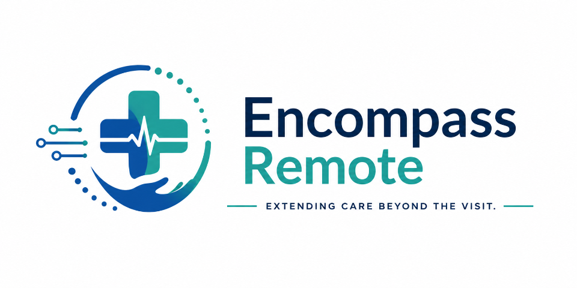

# 👋 Welcome to Encompass Remote, INC.

**Harmonizing Diagnostic Data Across Specialties**

Encompass Remote is a healthcare technology company committed to expanding access to care for individuals with chronic conditions. Through optimized workflows and enhanced reimbursement strategies, we aim to alleviate administrative burdens on clinics and hospitals—delivering efficient, compliant, and patient-centric services.

---

## 🏥 About Us

With more than a century of combined expertise in cardiology, electrophysiology, and healthcare technology, our interdisciplinary team includes physicians, nurses, technologists, and billing professionals. Encompass Remote was founded to address critical gaps in remote monitoring and virtual care—empowering clinicians with timely, concise, and actionable diagnostic data.

---

## 💡 Our Services

We deliver a robust suite of remote and virtual care solutions designed to support healthcare providers and improve patient outcomes:

- **Cardiac Implanted Electronic Devices (CIEDs):** Unifying multiple cardiac rhythm management platforms into a seamless digital experience.
- **Remote Patient Monitoring (RPM):** Enabling continuous, passive measurement of vital signs with customized clinical pathways tailored to patient needs.
- **Ambulatory Cardiac Monitoring:** Offering diagnostic reporting throughout the patient journey, reinforcing the role of cardiac monitors in proactive care.
- **Chronic Care Management (CCM):** Partnering with providers to deliver critical components of longitudinal care—enhancing outcomes and driving patient satisfaction.

---

## 🏆 Our Vision

At Encompass Remote, we are driven by a shared mission to:

- Expand equitable access to chronic care services.
- Equip clinicians with intelligent, data-driven insights.
- Streamline clinical and administrative workflows.
- Advance reimbursement strategies through compliant, sustainable practices.

---

## 👥 Leadership Team

- **Beyan Bonal, MBA, RCIS, NASPE TESTAMUR** — Chief Executive Officer
- **Tristan Smith, MD** — Chief Medical Advisor
- **Margo B** - Lead Software Engineer  
- **Latoya Linton-Frazier, MD** — Medical Advisor, RPM & CCM, CIED 
- **Nancy Bonnet, NP** — Clinical Advisor, Heart Failure & Chronic Care  
- **Roberta “Bobbie” Kurta, RN** — Patient Care Specialist  
- **Dawn Kociban** — Director, Patient Care Specialist  
- **Stacy Pollack** — VP, Health Care Economical &Billing Services (CCM)
---

## 📍 Contact Us

- 📫 **Email:** [clientservices@encompassremote.net](mailto:clientservices@encompassremote.net)  
- ☎️ **Phone:** 833-717-7399 
- 📬 **Mailing Address:** 2400 Ansys Dr. Ste 102, Canonsburg, PA 15317

---

## 🔗 Learn More

- 🌐 [encompassremote.net](https://encompassremote.net/)
- 📄 [About Us](https://encompassremote.net/about-us/)
- 📚 [Information](https://encompassremote.net/information/)
- 📰 [News](https://encompassremote.net/news/)

---

*Empowering clinicians and patients through innovative remote healthcare solutions.*
